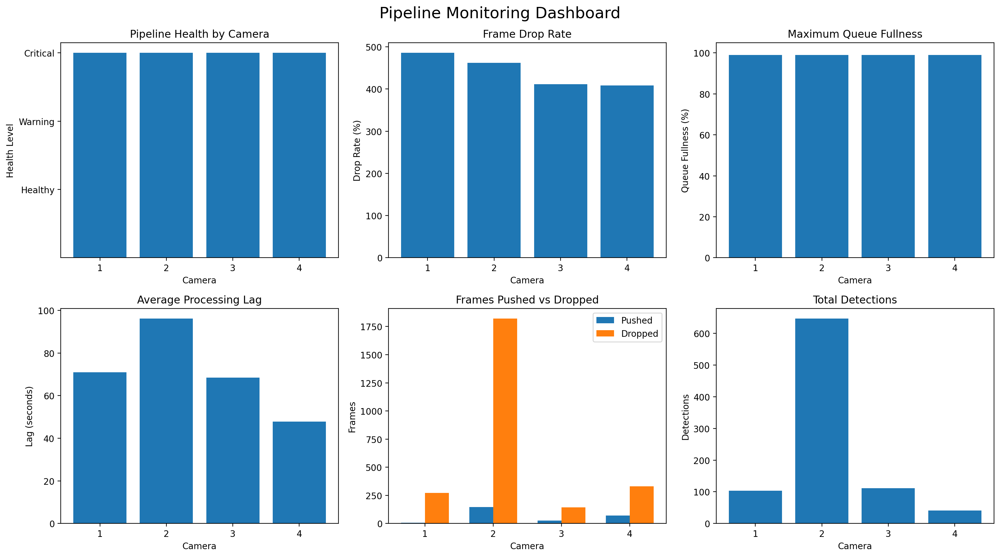

# Pipeline Monitoring & Optimization

## 1. Project Overview

This project implements a multi-camera video processing pipeline that simulates a real-time computer vision monitoring system.

The system uses a producer-consumer architecture to separate video ingestion from object detection:

```text
Video Sources
     ↓
Producer Threads
     ↓
Bounded Queue
     ↓
Detection Workers
     ↓
Detection Results + Logs
     ↓
Monitoring Dashboard
```

---

## 2. Objectives

- Process multiple video/camera sources concurrently.
- Separate frame ingestion and detection using producer-consumer architecture.
- Use a bounded queue to control buffering and memory usage.
- Perform configurable YOLO-based object detection.
- Monitor frame drops, queue fullness, processing latency, and camera activity.
- Generate structured logs and a camera-level monitoring dashboard.


---

## 3. System Architecture

The system is organized into independent modules that work together as a
producer-consumer pipeline.

### Pipeline Flow

Video File / Live Camera
        ↓
Source Discovery
        ↓
Producer Threads
        ↓
Bounded Queue
        ↓
Detection Worker(s)
        ↓
Detection Results
        ↓
JSONL Events + Annotated Frames
        ↓
Monitoring Summary + Dashboard

### Pipeline Components

1. **Source Discovery:** Selects configured video files or camera devices.
2. **Producer Threads:** Read and sample frames from each source and attach camera/timestamp information.
3. **Bounded Queue:** Buffers frames between ingestion and detection. Frames are counted as dropped when the queue is full.
4. **Detection Workers:** Consume queued frames and run YOLO inference.
5. **Logging:** Stores structured pipeline events in JSONL format.
6. **Monitoring:** Aggregates frame drops, queue fullness, processing lag, and detection activity.
7. **Dashboard:** Visualizes camera-level pipeline health and performance.

---

## 4. Technologies Used

- Python
- OpenCV
- Ultralytics YOLO
- NumPy
- Matplotlib
- Python Threading
- Python Queue
- JSON / JSONL
- Pandas

---

## 5. Monitoring Metrics

The pipeline records per-camera operational metrics to identify ingestion
and processing bottlenecks.

| Metric | Purpose |
|---|---|
| **Frames Pushed** | Number of sampled frames successfully queued |
| **Frames Dropped** | Frames discarded when the queue is full |
| **Frame Drop Rate** | Measures the proportion of dropped frames |
| **Queue Size** | Current number of frames waiting for processing |
| **Queue Fullness** | Indicates queue saturation |
| **Processing Lag** | Time between frame capture/ingestion and worker processing |
| **Object Detections** | Number of objects detected by YOLO |

These metrics help identify excessive ingestion, queue
saturation, slow detection, and increasing processing latency.

---

## 6. Monitoring Dashboard

The project generates a monitoring dashboard containing:

1. Pipeline Health by Camera
2. Frame Drop Rate
3. Maximum Queue Fullness
4. Average Processing Lag
5. Frames Pushed vs Dropped
6. Total Detections

Dashboard:

`results/pipeline_monitoring_dashboard.png`



---

## 7. Results & Outputs

The pipeline has been tested with multiple video sources and live camera sources.

A completed notebook run produces:

```text
results/
├── detections/
├── pipeline_events.jsonl
└── pipeline_monitoring_dashboard.png
```

- `detections/` — annotated frames containing detected objects
- `pipeline_events.jsonl` — structured pipeline and monitoring events
- `pipeline_monitoring_dashboard.png` — camera-level monitoring dashboard

---

## 8. Configuration

Runtime behaviour is controlled through:

`config/config.json`

Important settings:

- `model.name` — YOLO model file
- `detection.confidence_threshold` — detection confidence threshold
- `detection.frame_interval` — frame sampling interval
- `pipeline.max_frames_per_camera` — maximum successfully queued video frames per source
- `pipeline.max_retries` — source opening retries
- `pipeline.queue_maxsize` — queue capacity
- `pipeline.num_workers` — detection workers
- `input.mode` — input source mode
- `input.video_dir` — video directory
- `input.camera_indices` — camera device indices
- `output.detections_dir` — detection output directory
- `output.log_file` — JSONL log path
- `output.dashboard_file` — dashboard path

---

## 9. Installation

Install the required dependencies:

```bash
pip install -r requirements.txt
```

---

## 10. Project Structure

```text
grochenn_video_systems/
│
├── app/
│   ├── camera.py
│   ├── config.py
│   ├── dashboard.py
│   ├── detector.py
│   ├── logger.py
│   ├── main.py
│   ├── monitoring.py
│   └── pipeline.py
│
├── config/
│   ├── classes.txt
│   └── config.json
│
├── models/
│   └── yolov8s-worldv2.pt
│
├── results/
│   ├── detections/
│   ├── pipeline_events.jsonl
│   └── pipeline_monitoring_dashboard.png
│
├── videos/
├── main.ipynb
├── requirements.txt
└── README.md
```

---

## 11. Running the Project

The project can be run using the provided Jupyter notebook and the
configuration file.

### Step 1. Prepare the Model

Place the configured YOLO model inside:

```text
models/
```

The model name is configured in:

```text
config/config.json
```

### Step 2. Prepare Input Videos

For video-based testing, place input video files inside:

```text
videos/
```

Multiple video files can be placed in the directory and are treated as
independent camera sources.

### Step 3. Configure the Pipeline

Update:

```text
config/config.json
```

Important settings include model, confidence threshold, frame interval, queue capacity, worker count, input mode, and output paths.

For automatic source selection:

```json
"input": {
    "mode": "auto",
    "video_dir": "videos",
    "camera_indices": [1]
}
```

In auto mode, videos are checked first; if none are available, configured camera devices are used.

### Step 4. Run

Open:

```text
main.ipynb
```

and run:

```python
run_pipeline(VIDEO_SOURCES, CONFIG, OBJECT_CLASSES)
```

The pipeline performs frame ingestion, buffering, YOLO detection, and event logging. Monitoring metrics and the dashboard are generated from the collected event log.

### Step 5. Review Outputs

Check:

```text
results/detections/
results/pipeline_events.jsonl
results/pipeline_monitoring_dashboard.png
```

---

## 12. Known Limitations

- Detection performance depends on available CPU/GPU resources.
- A single detection worker can become a bottleneck for high-rate or high-resolution streams.
- Queue saturation can cause frame drops when detection cannot keep up with ingestion.
- The queue is currently an in-memory bounded queue.
- Live camera streams are processed but not continuously recorded.
- Explicit YOLO `set_classes()` filtering is currently disabled because the additional text-model component caused a memory allocation error in the development environment.
- The dashboard is generated from collected run data rather than being a continuously streaming production dashboard.

---

## 13. Future Improvements

- Add RTSP and other network camera support.
- Replace the in-memory queue with Kafka or Redis Streams for larger deployments.
- Scale detection workers based on workload.
- Add real-time alerts for queue saturation, frame drops, and camera failures.
- Store monitoring metrics in a persistent monitoring system.
- Add a web-based real-time dashboard.
- Improve worker recovery and GPU-aware inference.

---
